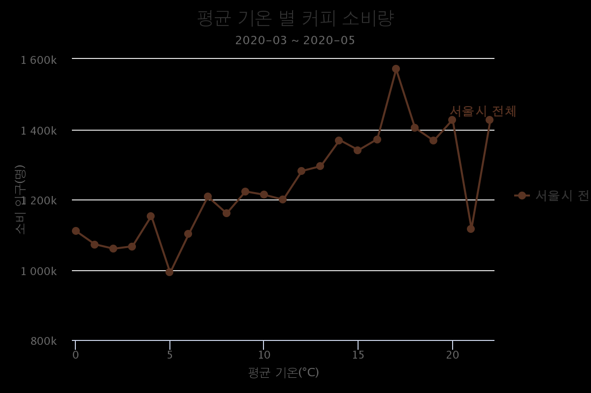
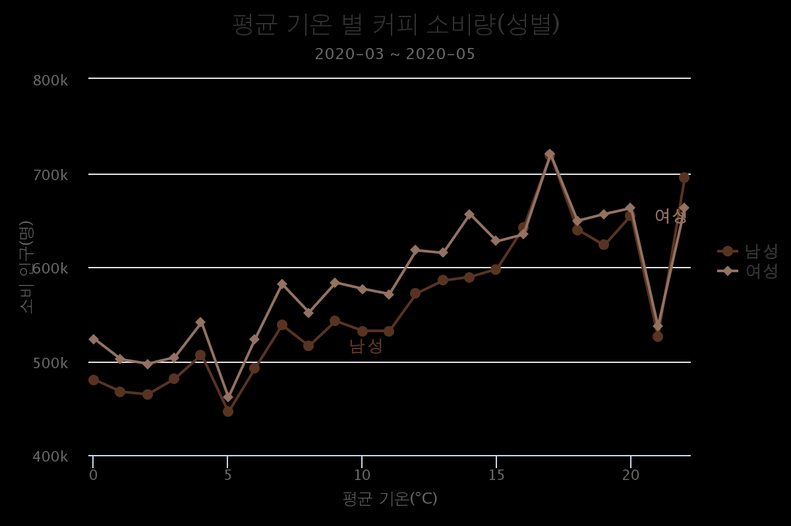
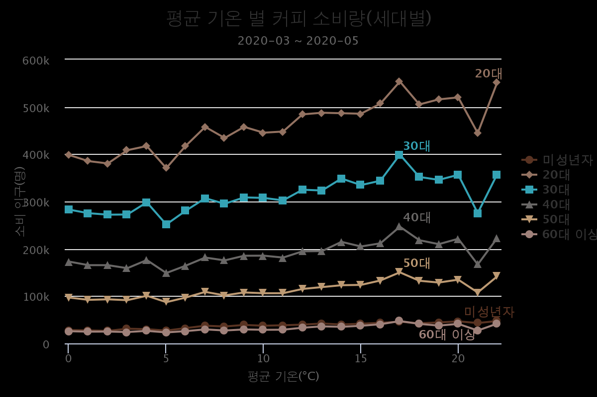

# weather-coffee
## 목표
EDA 할 데이터를 선정하고 파이썬 웹 프레임워크를 활용하여 웹 어플리케이션을 서버에 배포하고자 한다.
## 데이터
활용 데이터는 [기상청](https://data.kma.go.kr/climate/RankState/selectRankStatisticsDivisionList.do)의 평균기온 데이터와 [환경 비즈니스 빅데이터 플랫폼](https://www.bigdata-environment.kr/user/data_market/detail.do?id=306627b0-2f03-11ea-bccd-b704c648ae09#!)의 서울의 행정동별 커피분야 소비인구 데이터이며, 모든 데이터는 2020년 3월부터 5월까지의 데이터가 사용되었다.
## 사용 툴

 - Django
 - PythonAnywhere
 - Highcharts

## 결과
EDA한 결과 커피 소비인구는 평균 기온과 나이에 영향을 받는 다는 것을 확인 할 수 있었다. 다만 2020년 3월~5월까지의 짧은 기간에 데이터로 다른 계절에 대한 정보가 부족하였다는 한계가 있었다. 
### 1. 코드

 - **평균 기온 데이터의 경우 1°C 간격으로 묶어 소비량의 합을 구하였다.**

```python
da[‘avg_tem’]=da[‘avg_tem’].round(0)  
a=da[[‘date’,‘avg_tem’,‘sell’]].groupby([‘date’]).agg({‘avg_tem’:‘mean’,‘sell’:‘sum’})  
b=a.reset_index().groupby([‘avg_tem’]).mean().reset_index()
```
   

 - **데이터베이스 모델의 경우 다음과 같이 3개의 클래스를 만들어 생성하였다.**
```python
class DataOrigin(models.Model): # 전체 데이터
	temperature = models.FloatField(default=0, null=False)
	count = models.FloatField(default=0)

class DataSex(models.Model): # 성별 데이터
	temperature = models.FloatField(default=0, null=False)
	count = models.FloatField(default=0)
	sex = models.CharField(default='',max_length=3)

class DataAge(models.Model): # 세대별 데이터
	temperature = models.FloatField(default=0, null=False)
	count = models.FloatField(default=0)
	age = models.CharField(default='',max_length=4)
```
 - **기존에 csv파일로 저장한 데이터는 add_data 함수를 통해 데이터베이스에 저장하였다.**
```python
path = './data/data.csv'
file = open(path)
reader = csv.reader(file)
next(reader)
list = []
for row in reader:
	list.append(DataOrigin(temperature=row[1],count=row[2]))
DataOrigin.objects.bulk_create(list)
file.close()
```
 - **index 함수**
```python
def index(request):
	data = DataOrigin.objects.values()
	data_json = json.dumps(list(data), cls=DjangoJSONEncoder)
	data1 = DataSex.objects.values()
	data_json1 = json.dumps(list(data1), cls=DjangoJSONEncoder)
	data2 = DataAge.objects.values()
	data_json2 = json.dumps(list(data2), cls=DjangoJSONEncoder)
	context = {
		'data_json': data_json,
		'data_json1': data_json1,
		'data_json2': data_json2,
	}
	return render(request, 'index.html', context)
```
### 2. 분석



상관계수 분석결과 커피 수요량과 평균 기온은 0.833693로 강한 양의 상관관계가 있음을 확인할 수 있었다. 20대 이후 커피 소비량의 경우 -0.937243로 강한 음의 상관관계가 있음을 확인할 수 있었다.
### 3. [링크](http://som2303.pythonanywhere.com/)
